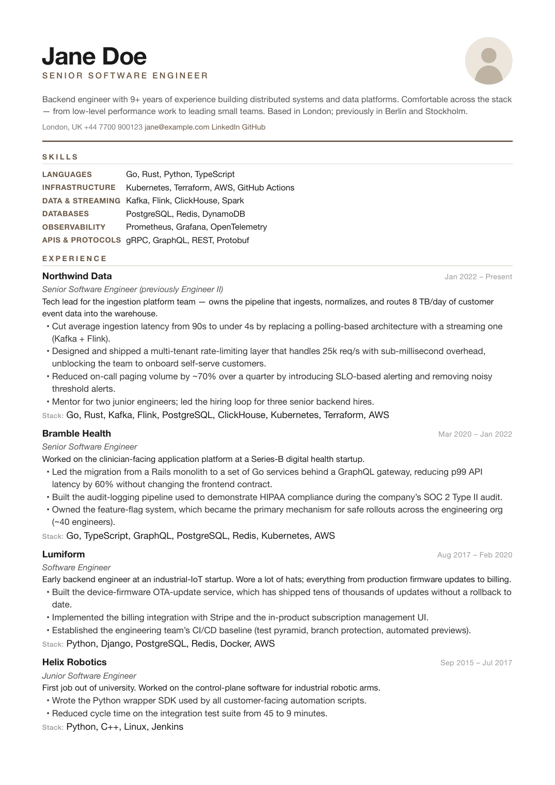
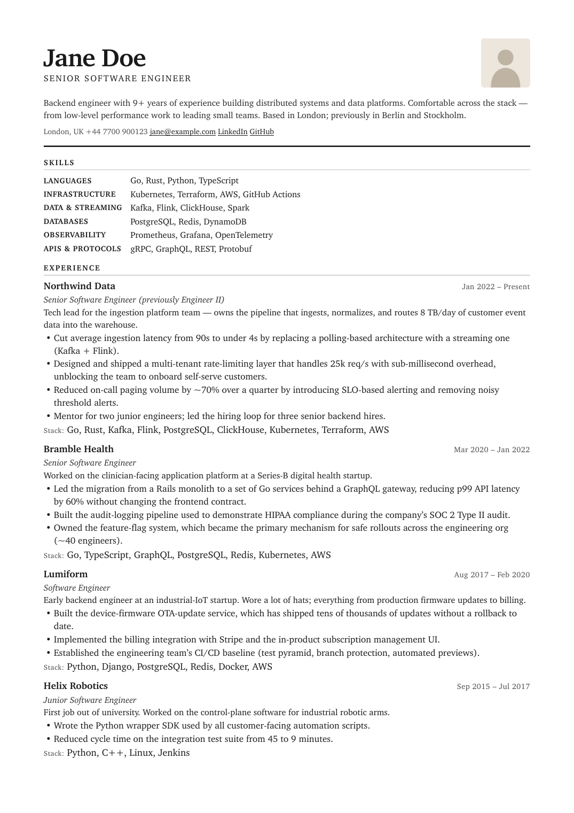
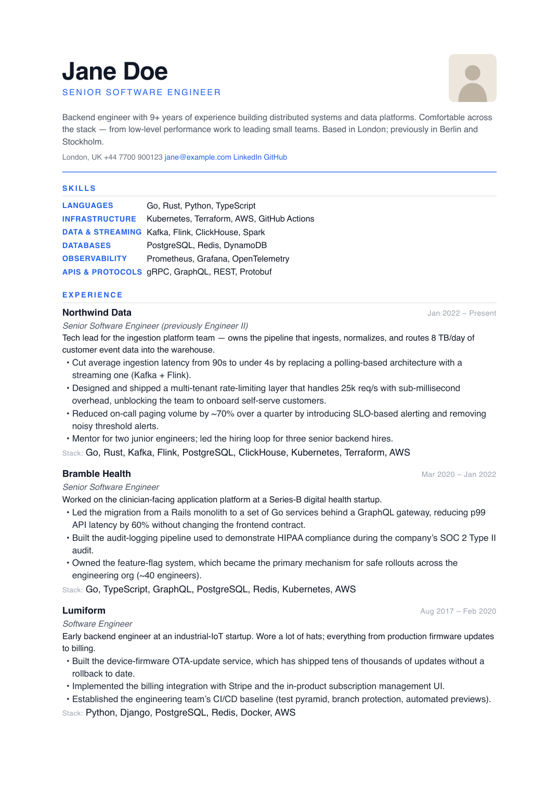

# resume-md

Print-quality PDF resumes from a single Markdown file. Pandoc + WeasyPrint with a deliberate, themeable design system.

You write Markdown. You run `make`. You get:

- a polished `resume.pdf` ready to send,
- a single self-contained `index.html` you can host anywhere or open in a browser.

No layout editor, no proprietary format, no lock-in. Your resume is plain text under version control.

## Why

Most resume tools optimize for the wrong things: drag-and-drop layouts, "creative" templates, or full-page sidebars that look fine on a 27" monitor and break in print. The result is usually generic, badly typeset, and impossible to keep in git.

`resume-md` starts from the opposite end — a single Markdown file, a small CSS theme system, and a deterministic build pipeline.

See [`docs/PRODUCT.md`](docs/PRODUCT.md) for the design philosophy and [`docs/DESIGN.md`](docs/DESIGN.md) for the visual system.

## Quick start

1. Click **Use this template** on GitHub to create your own copy.
2. Install the two binaries the build pipeline needs:

   ```bash
   # macOS
   brew install pandoc
   pipx install weasyprint

   # Debian / Ubuntu
   sudo apt-get install pandoc weasyprint
   ```

3. Verify everything is wired up:

   ```bash
   make check
   ```

4. Edit `resume.md`:
   - The block at the top between the `---` lines (the frontmatter) holds your name, role, photo, summary, and contact items.
   - Everything below is normal Markdown — sections for skills, experience, education, etc.
   - Full reference: [`docs/authoring.md`](docs/authoring.md).

5. Build:

   ```bash
   make            # writes index.html and resume.pdf with the default theme
   make preview    # build, then open in your browser
   make THEME=classic
   ```

## Targets

| Command | What it does |
|---|---|
| `make` | Generate `index.html` + `resume.pdf` with the default theme (`warm-ink`). |
| `make THEME=<name>` | Use a different theme from `themes/`. |
| `make preview` | Build, then open `index.html` in your default browser. |
| `make check` | Verify `pandoc` and `weasyprint` are on `PATH`. |
| `make clean` | Remove generated outputs (`.build/`, `index.html`, `resume.pdf`). |

## Themes

Six themes ship in `themes/`. The first three are conservative defaults; the next three lean further into typography and palette.

**Conservative trio** (screenshots below):

| | | |
|---|---|---|
|  |  |  |
| **`warm-ink`** (default) — Helvetica Neue + warm ochre accent on paper-tinted background. The original design. | **`classic`** — Charter/Georgia serif, black on white, no chromatic accent. Conservative, academic. | **`modern`** — Inter sans-serif, blue accent, more whitespace. Tech-recruiter friendly. |

**Creative trio** (no screenshots yet — `make THEME=<name> preview` to see them):

- **`midnight`** — Dark mode. Warm-cream ink on near-black paper, amber accent. Screen-first; prints dark, so check with `make THEME=midnight preview` before sending to anyone who'll spool it.
- **`terminal`** — Monospace everywhere (JetBrains Mono → system fallbacks), terminal-green accent, prompt-prefix on section headings (`$ EXPERIENCE`). For engineering CVs where the medium is the message.
- **`saffron`** — Bold expressive light theme. Saturated saffron-orange accent on warm cream, with a display-serif × body-sans split (Charter on the name, Inter in the body) for editorial contrast.

Switch with `make THEME=<name>`.

Authoring a new theme is mostly setting CSS variables — see [`docs/themes.md`](docs/themes.md) for the variable reference.

## Sharing the HTML

`make` produces a single self-contained `index.html` (the headshot is base64-embedded, CSS is inlined). Drop it in any static host — GitHub Pages, Netlify, your own server — or attach to an email. No external assets to forget.

## Architecture

```
resume.md ──► pandoc ──► index.html ──► weasyprint ──► resume.pdf
                ▲                  ▲
                │                  └── single self-contained file
                │                      (CSS inlined, images embedded)
                │
                └── themes/_base.css + themes/<theme>.css concatenated
```

Two binaries do all the real work; the `Makefile` orchestrates them.

## Requirements

- Pandoc 2.x or 3.x
- WeasyPrint (latest)
- GNU Make
- A POSIX-y operating system (macOS and Linux are tested; Windows likely works under WSL).

## Contributing

See [`CONTRIBUTING.md`](CONTRIBUTING.md).

## License

[MIT](LICENSE).

## Credits

The design system originated as Hugo Sjöberg's personal resume styling. The themes in this repository are extracted, documented, and generalized from that work.
